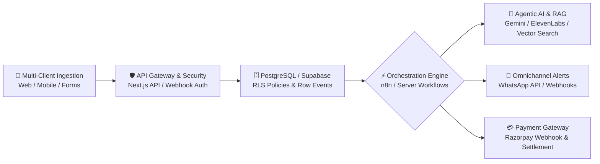

<!-- ========================================================================= -->
<!--                           MOHAMMED REHAN | GITHUB PROFILE                  -->
<!-- ========================================================================= -->

<div align="center">


<a href="https://readme-typing-svg.demolab.com">
  
</a>

<br><br>

<p align="center">
  
  
  
  
</p>

<p align="center">
  <a href="https://mdrehan.vercel.app" target="_blank"></a>
  <a href="mailto:mrofficialyt083@gmail.com"></a>
  <a href="https://github.com/mohammedrehan143"></a>
  <a href="https://linkedin.com"></a>
  
</p>

</div>

---

# 👨‍💻 About Me

<table>
<tr>
<td width="63%" valign="top">

### Full-Stack & Agentic AI Engineer 🚀

I engineer intelligent, production-grade applications that combine **autonomous AI agents**, **Retrieval-Augmented Generation (RAG)**, and **scalable full-stack architectures**.

- 🤖 **Agentic AI & LLMs**: Architecting multi-step agent workflows, tool-using AI systems, conversational voice bots, and high-precision RAG pipelines over complex documents.
- 🌐 **Full-Stack & Cloud**: Building high-performance web applications and SaaS platforms with **Next.js**, **React**, **Node.js**, **TypeScript**, and **Supabase**.
- ⚡ **Workflow Automation**: Designing resilient event-driven systems, webhook integrations, and automated WhatsApp notification pipelines with **n8n**.
- 📊 **Data & Vision**: Processing end-to-end data pipelines with **Python**, **Pandas**, **NumPy**, and real-time computer vision with **OpenCV** & **MediaPipe**.
- 🛠️ **System Architecture**: Designing multi-tenant schemas, secure payment gateways (**Razorpay**), and rock-solid Row Level Security (**RLS**).

*⚡ "Engineering systems that think, automate, and scale."*

</td>
<td width="37%" align="center" valign="middle">


</td>
</tr>
</table>

---

# ⚡ Current Engineering Focus & Education

<table>
<tr>
<td width="55%" valign="top">

### 🎯 Specialization Roadmap
```yaml
Core Architecture:
  - Agentic AI Systems & Multi-Step Tool Workflows
  - Vector Databases & Production RAG Architectures
  - Multi-Tenant SaaS & Event-Driven Backends
  - Self-Hosted Infrastructure & Docker Orchestration

Currently Architecting:
  - SmartX AI Tutor: Adaptive multi-agent educational assistant
  - ClauseWise: AI legal contract analyzer & risk detector
  - WhatsApp Automation Platform: Multi-client reminder engine via n8n & Supabase
  - VoiceOps: Autonomous voice receptionist using Retell AI & ElevenLabs

Distributed Scaling:
  - Apache Spark • Kafka • Airflow • Cloud Data Pipelines
```

</td>
<td width="45%" valign="top">

### 🎓 Education & Background
```yaml
Institution:
  BMS Institute of Technology & Management

Discipline:
  Artificial Intelligence & Machine Learning Engineering 

Focus Areas:
  - Artificial Intelligence & Machine Learning
  - Data Engineering & Pipelines
  - Full-Stack Cloud Architecture

Engineering Philosophy:
  "Clean Code > Clever Code"
  "Code with purpose, automate with intelligence"
```

</td>
</tr>
</table>


# 💻 Tech Universe

<div align="center">
  <p><i>A curated view of the languages, frameworks, AI models, and infrastructure I leverage daily.</i></p>
</div>

<table>
  <tr>
    <td width="50%" valign="top">
      <h3 align="left">🚀 Programming Languages</h3>
      <a href="#"></a>
      <br><br>
      <h3 align="left">🌐 Frontend Engineering</h3>
      <a href="#"></a>
      <br>
      <sub><code>Next.js (App/Pages)</code> • <code>React</code> • <code>TypeScript</code> • <code>Tailwind CSS</code> • <code>Vite</code> • <code>PWA</code> • <code>Responsive UI</code></sub>
      <br><br>
      <h3 align="left">⚙️ Backend, APIs & Webhooks</h3>
      <a href="#"></a>
      <br>
      <sub><code>Node.js</code> • <code>Express.js</code> • <code>Next.js API Routes</code> • <code>RESTful APIs</code> • <code>Webhooks</code> • <code>Auth Flows</code></sub>
      <br><br>
      <h3 align="left">🗄️ Databases & BaaS</h3>
      <a href="#"></a>
      <br>
      <sub><code>PostgreSQL</code> • <code>Supabase (Auth / Storage / RLS)</code> • <code>MongoDB / Mongoose</code> • <code>Schema Design</code></sub>
    </td>
    <td width="50%" valign="top">
      <h3 align="left">🧠 AI, LLMs & Agentic Systems</h3>
      <p>
        
        
        
      </p>
      <p>
        
        
        
        
      </p>
      <sub><code>Autonomous Agents</code> • <code>Vector Search</code> • <code>Tool Calling</code> • <code>Voice AI</code> • <code>Prompt Engineering</code></sub>
      <br><br>
      <h3 align="left">⚡ Workflow Automation & Payments</h3>
      <p>
        
        
        
        
      </p>
      <sub><code>DB Triggers</code> • <code>Multi-Client Architecture</code> • <code>Automated Messaging</code> • <code>Payment Webhooks</code></sub>
      <br><br>
      <h3 align="left">📊 Data Science & Computer Vision</h3>
      <p>
        
        
        
        
      </p>
      <sub><code>JupyterLab</code> • <code>Anaconda</code> • <code>Image & Video Processing</code> • <code>ETL Data Pipelines</code></sub>
      <br><br>
      <h3 align="left">☁️ DevOps, Cloud & Infrastructure</h3>
      <a href="#"></a>
      <br>
      <sub><code>Docker</code> • <code>Ubuntu / VPS Hosting</code> • <code>Custom Domains & DNS</code> • <code>Always-on Services</code></sub>
    </td>
  </tr>
</table>

---

# 📐 System Architecture Blueprint

An architectural mental model I apply when designing production-grade, event-driven SaaS and AI automation systems:



---

# 🚀 Featured Projects & Engineering Highlights

<table>
  <thead>
    <tr>
      <th width="28%">Project</th>
      <th width="48%">Overview & Engineering Impact</th>
      <th width="24%">Tech Stack</th>
    </tr>
  </thead>
  <tbody>
    <tr>
      <td><b>🤖 SmartX AI Tutor</b></td>
      <td>AI-powered adaptive educational platform delivering interactive tutoring, personalized quiz generation, and concept breakdown for students.</td>
      <td><code>Next.js</code> <code>Gemini API</code> <code>TypeScript</code> <code>Supabase</code></td>
    </tr>
    <tr>
      <td><b>⚖️ ClauseWise</b></td>
      <td>AI legal contract analyzer automating contract review, detecting potential risk clauses, and scoring compliance through deep LLM reasoning.</td>
      <td><code>Next.js</code> <code>RAG</code> <code>OpenRouter</code> <code>Tailwind CSS</code></td>
    </tr>
    <tr>
      <td><b>📄 StudyMate PDF Q&A</b></td>
      <td>Retrieval-Augmented Generation (RAG) system enabling contextual conversational QA over complex multi-page documents and PDFs using vector embeddings.</td>
      <td><code>Python</code> <code>RAG</code> <code>Vector Search</code> <code>FastAPI</code></td>
    </tr>
    <tr>
      <td><b>🩺 Medical Prescription Verification</b></td>
      <td>Computer vision and AI-powered healthcare document verification system that extracts, parses, and validates prescription data.</td>
      <td><code>Python</code> <code>OpenCV</code> <code>MediaPipe</code> <code>OCR</code></td>
    </tr>
    <tr>
      <td><b>🎙️ VoiceOps — AI Receptionist</b></td>
      <td>Autonomous conversational voice platform managing inbound/outbound customer queries, call workflows, and automated communication.</td>
      <td><code>Retell AI</code> <code>ElevenLabs</code> <code>Node.js</code> <code>Webhooks</code></td>
    </tr>
    <tr>
      <td><b>🔊 EchoVerse</b></td>
      <td>AI audiobook and expressive voice generation engine transforming text into lifelike speech with dynamic pacing and emotional nuance.</td>
      <td><code>Python</code> <code>ElevenLabs</code> <code>pyttsx3</code> <code>Audio AI</code></td>
    </tr>
    <tr>
      <td><b>📲 WhatsApp Automation Engine</b></td>
      <td>Database-driven customer reminder and notification pipeline orchestrating automated multi-client messaging via event triggers.</td>
      <td><code>n8n</code> <code>WhatsApp API</code> <code>Supabase</code> <code>Docker</code></td>
    </tr>
    <tr>
      <td><b>⚡ EV Charging Station Locator</b></td>
      <td>Smart EV charging platform featuring real-time station discovery, slot reservations, distance-based booking, and interactive map navigation.</td>
      <td><code>React</code> <code>Node.js</code> <code>MongoDB</code> <code>Maps API</code></td>
    </tr>
    <tr>
      <td><b>🛍️ NextGen E-Commerce & Menu QR SaaS</b></td>
      <td>Full-stack commercial platform featuring digital QR menus, dynamic catalogs, Google Maps integration, and secure Razorpay payment webhooks.</td>
      <td><code>React</code> <code>Node.js</code> <code>Razorpay</code> <code>PostgreSQL</code></td>
    </tr>
    <tr>
      <td><b>🏆 Epoch Hub</b></td>
      <td>Internal club task-management and gamification dashboard designed for team milestone tracking, role-based workflows, and productivity metrics.</td>
      <td><code>Next.js</code> <code>Supabase RLS</code> <code>Tailwind</code> <code>TypeScript</code></td>
    </tr>
    <tr>
      <td><b>💰 Personal Finance AI</b></td>
      <td>Conversational financial intelligence assistant analyzing personal spending habits, budget anomalies, and cash flow projections.</td>
      <td><code>Python</code> <code>LLM APIs</code> <code>Pandas</code> <code>NumPy</code></td>
    </tr>
    <tr>
      <td><b>🌐 Interactive Portfolio Website</b></td>
      <td>Modern animated engineering portfolio showcasing interactive project demos, responsive design, and smooth user experiences. <a href="https://mdrehan.vercel.app" target="_blank"><b>Live Site ↗</b></a></td>
      <td><code>React</code> <code>TypeScript</code> <code>Tailwind</code> <code>Vercel</code></td>
    </tr>
  </tbody>
</table>

---

# 📊 GitHub Analytics Dashboard

<div align="center">

<table border="0">
  <tr>
    <td align="center" width="50%">
      
    </td>
    <td align="center" width="50%">
      
    </td>
  </tr>
</table>

<br>


</div>

---

# 🏆 GitHub Achievements

<div align="center">


</div>

---

# 📈 Contribution Graph & Activity

<div align="center">


<br><br>


</div>

---

# 🤝 Let's Connect & Collaborate

<div align="center">
  <p>I'm always open to discussing <b>Agentic AI systems</b>, <b>autonomous workflows</b>, <b>Full-Stack SaaS</b>, or <b>open-source collaborations</b>.</p>

  <p align="center">
    <a href="https://mdrehan.vercel.app" target="_blank">
      
    </a>
    <a href="mailto:mrofficialyt083@gmail.com">
      
    </a>
    <a href="https://github.com/mohammedrehan143">
      
    </a>
    <a href="https://linkedin.com">
      
    </a>
    <a href="https://twitter.com">
      
    </a>
  </p>

  <br>

  

  <br><br>

  <a href="https://mdrehan.vercel.app" target="_blank">
    
  </a>

  <br><br>
  <b>⚡ "Code with purpose, automate with intelligence, build to scale."</b>
  <br><br>

</div>


